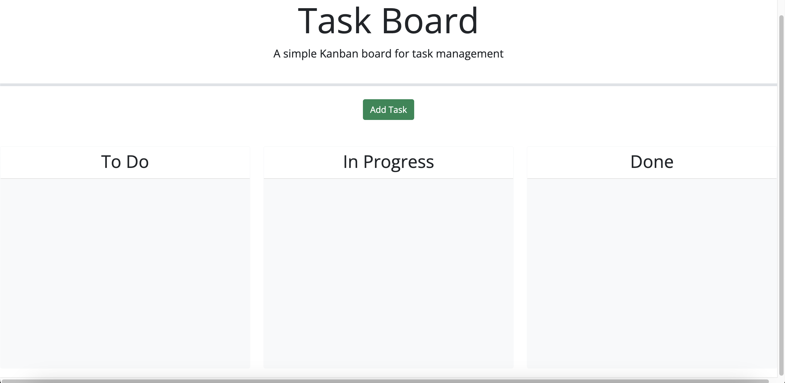
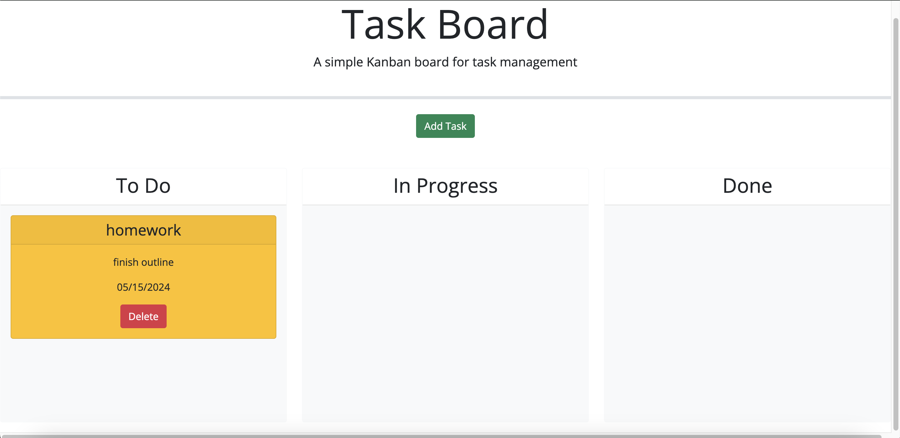

# task-board

Scope of work:

This challenge required me to create a simple task board application that allows a team to manage project tasks by modifying starter code. This app will run in the browser and feature dynamically updated HTML and CSS powered by jQuery.

## Website

click link to view [website](https://ejacosta86.github.io/task-board/).

## Preview

## License

[MIT](https://choosealicense.com/licenses/mit/)